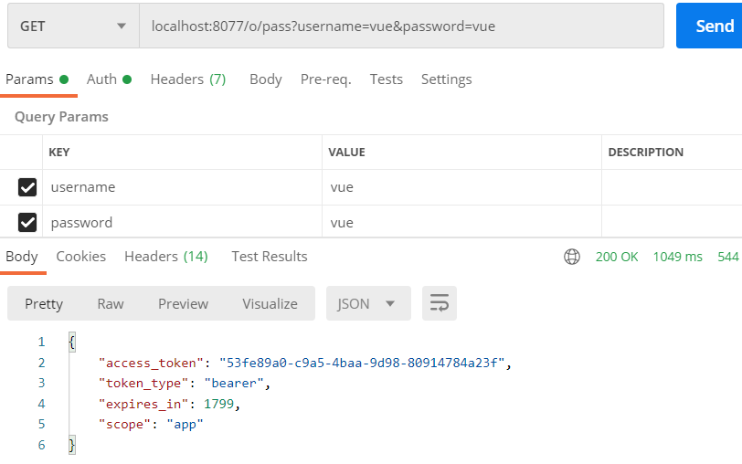

# OAuth2使用RestTemplate请求token
在第一次提交的authorization-server基础上锦上添花

如果你不想看简单化的的代码请直接索引项目vong-oauth

## 以下是数据库数据的备注

v_user表加密密码:

> vue : vue

> admin : admin


oauth_client_details表加密密码:
 
> cli : sec
 
> client : secret
 
> clients : secrets

## 密码模式原请求

``` base
localhost:8077/oauth/token?client_id=cli&client_secret=sec&scopes=app&grant_type=client_credentials
```

> Basic Auth --- Username: cli & Password: sec

``` bash
localhost:8077/oauth/token?grant_type=client_credentials&scopes=app
```

## 封装的请求:

- 密码模式认证

``` java
    @RequestMapping("/pass")
    public MyTokenDto getPassToken(@RequestParam String username, @RequestParam String password) throws UserPrincipalNotFoundException {
        instance = CredentialsGrantInfo.getInstance();
        return new RestTemplate().getForObject(instance.toString(), MyTokenDto.class);
    }
```

- 授权码模式认证

``` java
    @RequestMapping("/code")
    public MyTokenDto getCodesToken(@RequestParam String code){
        instance = CodeGrantInfo.getInstance();
        instance.setCodes(code);
        return new RestTemplate().getForObject(instance.toString(), MyTokenDto.class);
    }

    @RequestMapping("/code/get")
    public MyTokenDto getCodes(){
        instance = CodeInfo.getInstance();
        return new RestTemplate().getForObject(instance.toString(), MyTokenDto.class);
    }
```

## 预期结果


